# Bash命令大全

## 前言
&emsp;&emsp;文字配合图片，理论搭配实践，助你轻松记住Bash命令，熟练运用将极大提升工作效率。

## 一.命令行
&emsp;&emsp;本篇**基础+重点**内容。

### 1.基本操作

* **export** ：展示全部的环境变量，如果你想获取某个特殊的变量，用 **echo $变量名**。
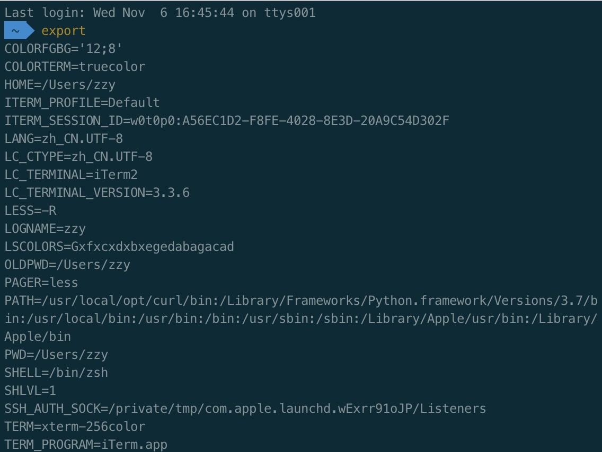
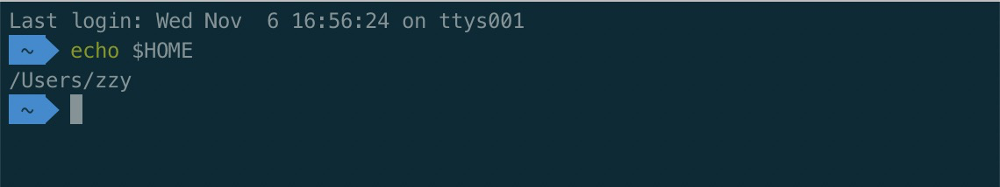

* **whatis** ：展示用户命令，系统调用、库函数等。
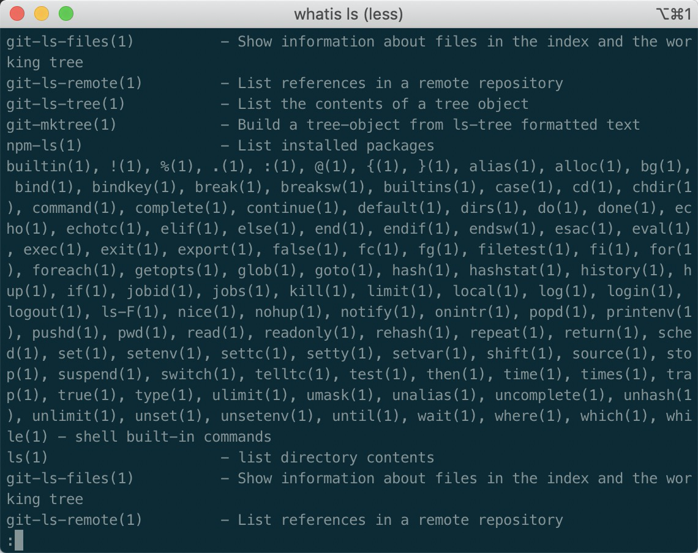

* **whereis** ：搜索可执行文件、源文件。

* **which** ：在环境变量中搜索可执行文件，并打印完整路径。
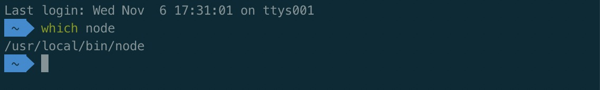

* **clear** ：清空屏幕。

### 2.目录操作

* **cd** ：进入指定目录。
e.g.  
cd xxx ：进入个人目录。  
cd - ：返回上次的目录。  
cd / ：进入根目录。
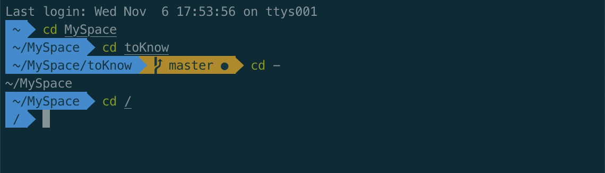

* **pwd** ：打印当前目录的路径。
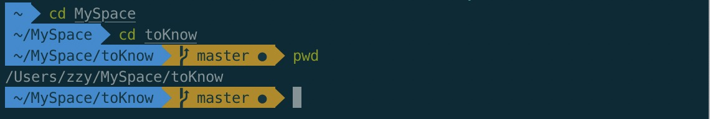

* **ls** ：列出文件与子目录，**-l** 显示长格式化，**-a** 显示包括隐藏文件。**ls** 除了能默认显示当前目录的文件以及子目录，还可以显示指定目录下的文件以及子目录。
e.g.  
ls ：列出当前目录中的文件以及子目录。  
ls ../ ：列出上级目录下的文件和子目录。  
ls / ：列出根目录下的文件和子目录。  
ls /home ：列出home目录下的文件和子目录。
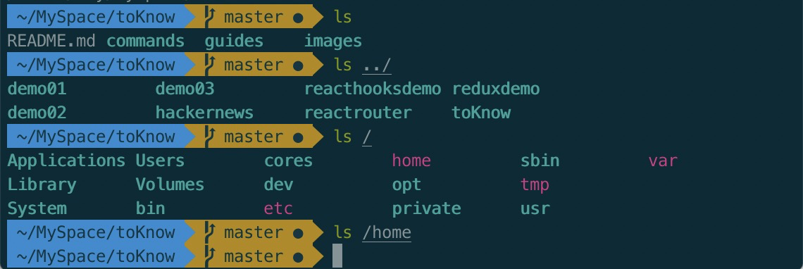

* **mkdir** ：创建目录。
e.g.  
mkdir xxx ：创建一个目录。  
mkdir xxx1 xxx2 xxx3 ：同时创建多个同级目录。  
mkdir -p a/b/c/d ：如果想创建一个目录树，可以附加一个 -p 参数。

* **rmdir** ：删除空目录。

* **rm -rf** ：强制删除目录（包括非空目录）。
e.g.  
rm -rf xxx ：删除一个非空目录。  
rm -rf xxx1 xxx2 xxx3 ：同时删除多个非空目录。  
rm -rf pattern ：删除按照指定模式匹配到的目录。

* **cp -a** ：复制目录到指定的位置。
e.g.  
cp -a xxx ../xxx ：将当前目录复制一份到上级目录中。  
cp -a xxx xxx1 ：复制目录并重命名。

* **mv** ：移动目录到指定位置。
e.g.  
mv xxx xxx1 ：统计移动，相当于重命名目录xxx为xxx1。  
mv xxx ../xxx1 ：将目录移动到上级目录中并重命名。  
sudo mv /home/user/xxx /home/ ：将指定位置的目录移动到指定位置中。  
mv * ../ ：将所有的目录与文件都复制到上级目录中（ **mv** 可以结合通配符进行使用）。  
**补充：** 利用 **mv** 命令同级移动功能，并结合重命名的特点，就可以做到目录的重命名。  
e.g.  
mv xxx xxx1 ：同级移动，相当于重命名目录xxx为xxx1。

* **tree** ：显示目录的树形图。
e.g.  
tree ：当前目录的树形图。  
tree / ：根目录下的树形图。

&emsp;**常用目录说明：** 
&emsp;&emsp;/ ：根目录。  
&emsp;&emsp;/bin ：命令保存目录。  
&emsp;&emsp;/boot ：启动目录。  
&emsp;&emsp;/dev ：设备文件命令。  
&emsp;&emsp;/etc ：配置文件保存目录。  
&emsp;&emsp;/home ：家目录。  
&emsp;&emsp;/lib ：系统库保存命令。  
&emsp;&emsp;/mnt ：系统挂载目录。

### 3.文件操作

* **touch** ：创建新文件。
e.g.  
touch xxx ：创建一个文件。  
touch xxx1 xxx2 xxx3 ：同时创建多个文件。  
touch xxx/yyy ：在指定的位置中创建一个文件。

* **rm** ：删除文件。
e.g.  
rm xxx ：删除xxx文件。  
rm xxx/yyy ：删除指定目录中的文件。  
rm xxx/* ：删除指定目录中的所有文件。

* **cp** ：复制文件到指定位置。
e.g.  
cp xxx xxx1：复制文件并重命名。  
cp xxx ../ ：复制文件到上级目录中。  
sudo cp xxx / ：复制文件到根目录中。  
cp xxx/* ./ ：将指定目录中的所有文件复制到当前目录中（ **cp** 可以结合通配符一起使用，将匹配到的文件复制到指定的位置中）。

* **mv** ：移动文件到指定的位置。
e.g.  
mv xxx ../：将文件移动到上级目录中。  
mv ../xxx ./ ：将上级的文件移动到当前目录中。  
sudo mv xxx / ：将文件移动到根目录中。  
mv xxx ../xxx1 ：**mv** 不仅可以移动文件，还可以在移动后重命名文件。  
mv xx?.txt ../ ：**mv** 还可以结合通配符使用。  
**补充：** 利用 **mv** 命令同级移动的功能再结合其可以重命名的特点，从而实现文件的重命名。  
e.g.  
mv xxx xxx1 ：同级移动，相当于重命名文件xxx为xxx1。

* **diff** ：比较文件内容。
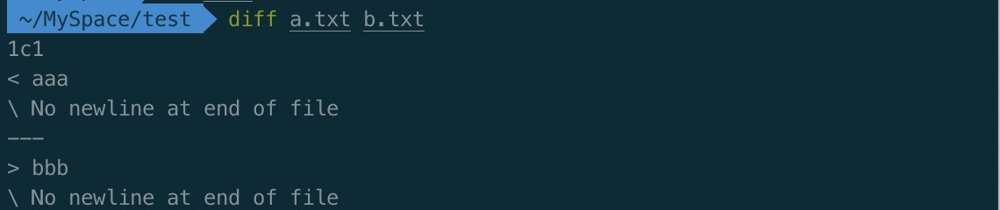

* **cat** ：在命令行工具中打印文件的内容。
e.g.  
cat xxx ：打印指定文件的内容。  
cat xxx yyy ：同时打印多个文件的内容。  
cat *.txt ：打印所有txt类型文件的内容（ **cat** 可以结合通配符来打印匹配到的所有文件内容）。
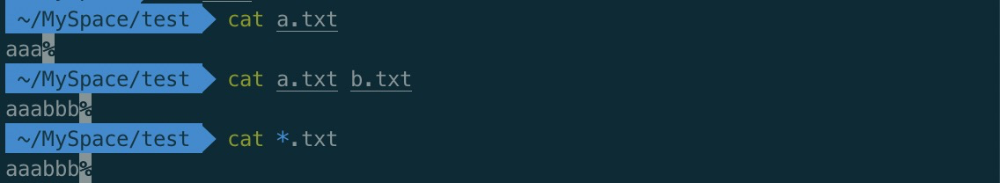
**补充： cat** 命令除了能打印文件的内容，还可以合并多个文件的内容保存到一个新的文件中。  
e.g.  
cat xxx yyy > zzz ：合并 xxx 和 yyy 文件的内容到新的 zzz 文件中。

* **less** ：如果查看的文件内容很多，还可以使用 **less** 命令。然后使用 **space** 便可以向下一页一页的翻动，或者 **pgup** 向上翻页 , **pgdn** 向下翻页，**q** 则可以退出 **less** 命令。

* **find** ：可以根据名称、大小、修改时间来查找指定的文件。**find** 命令默认在当前目录进行查找，你也可以指定一个目录进行查找。与根据文件名查找文件相同，也可以使用 **find** 按照目录名来查找目录。
e.g.  
find -name xxx ：在当前目录下查找 xxx 文件。  
find *.txt ：在当前目录下查找所有 txt 文件。  
find -empty ：查找所有为空的文件。  
find -size -1000 ：查找小于 1000KB 的文件。  
find -size +1000 ：查找大于 1000KB 的文件。  
find / -name *.txt ：在根目录下查找所有的 txt 文件。  
find /etc -name xxx ：在etc目录下查找 xxx 文件。
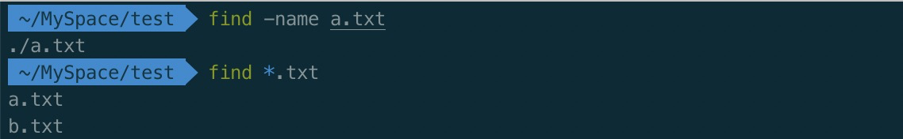

* **grep** ：可以根据指定的内容来查找含有这些内容的文件。如果想忽略内容的大小写可以附加一个 **-i** 的参数。显示匹配行及行号附加 **-n**。如果只显示文件名，不显示具体匹配到的内容，则附加 **-I** 参数。
e.g.  
grep pattern * ：查找当前目录含有指定匹配模式的文件。**pattren** 可以是一个正则表达式。  
grep xxx * ：查找当前目录含有单词 xxx 的文件。

* **head** ：查看文件前10行。

* **gzip** ：单独压缩指定的文件，压缩后删除被压缩文件，只保留压缩后的文件，并且不能压缩目录。
e.g.  
gzip xxx ：压缩指定的文件。  
gzip xxx1 xxx2 xxx3 ：同时压缩多个文件。  
gzip *.* ：gzip 还可以与通配符结合使用，压缩匹配到的文件。  
gzip -l xxx.gz ：若想列出某个 **.gz** 压缩文件中的内容，可以附加一个 **-l** 参数。

* **gunzip** ：解压某个 .gz 文件。

* **zip** ：与 **gzip** 相比，**zip** 可以压缩目录还可以将多个文件压缩在一起，并保留被压缩的文件。
e.g.  
zip xxx.zip yyy zzz ：将指定的文件压缩到一个新创建的压缩文件中。  
zip xxx.zip *.txt ：**zip** 也可以结合通配符使用，压缩匹配到的文件。  
zip xxx.zip yyy ：**zip** 还可以一次性压缩一个目录。  
zip -l xxx.zip ：若想列出某个 **.zip** 压缩文件中的内容，可以附加一个 **-l** 参数。

* **unzip** ：解压某个 .zip 文件。

* **tar** ：它是 Linux下的一个打包命令，它可以将一大堆松散的文件或者是目录打包在一起，从而保证资源的完整性。
e.g.  
tar -cvf package.tar xxx1 xxx2 xxx3 ：将指定的文件打包。
tar -cvf package.tar yyy ：如果要打包一个目录，则指定目录名。
tar -xvf package.tar ：如果想解包，则附加 **-xvf** 的参数即可。
tar -tvf package.tar ：如果只是想列出某个包中含有的文件或目录,则附加 **-tvf** 参数即可。

* **chmod** ：可以改变文件和目录的读、写、执行权限。

### 4.文本操作

* **awk**：非常有用的一个文本处理命令，逐行运行，默认使用空格分割，**-F** 表示分割的样式。
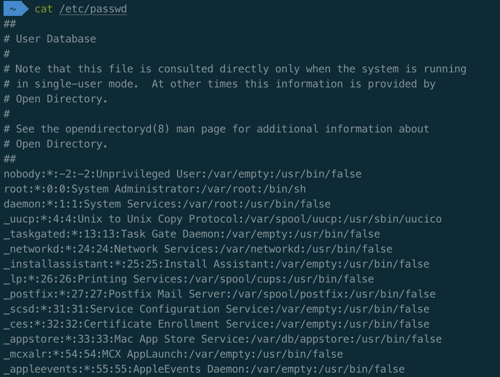
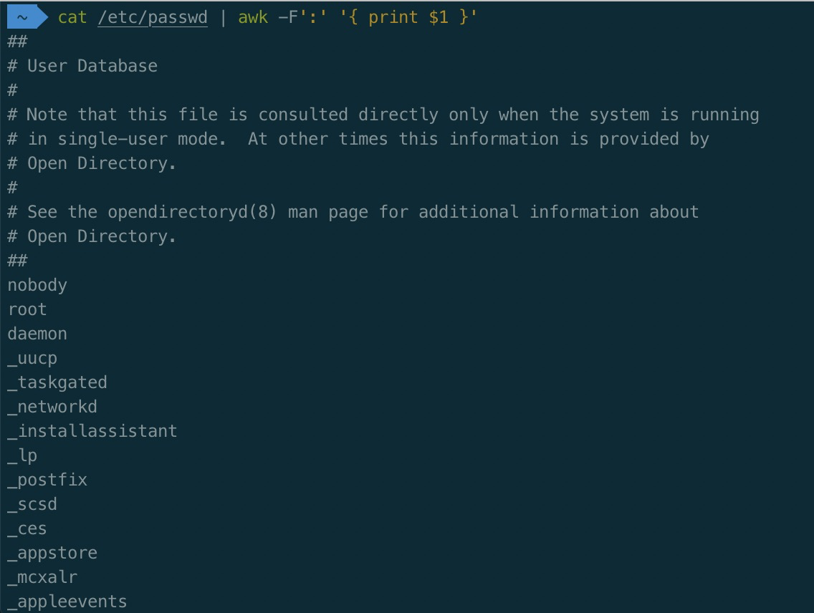

* **grep** ：匹配正则表达式的文本行，并输出，**-E** 正则模糊匹配，**-F** 精确字母匹配，**-w** 精确单词匹配。

* **sed** ：正则替换。
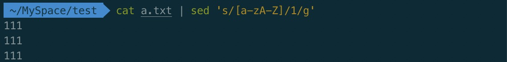

* **sort** ：排序。
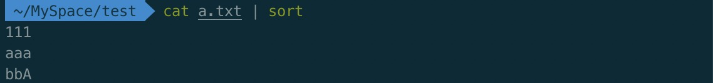

* **wc** ：统计文本行数，单词数，字符数。

### 5.SSH，系统信息，网络操作

## 二.内建指令

## 三.快捷键
&emsp;&emsp;熟记以下快捷键，将极大的提高你的命令行操作效率。

### 1.编辑命令

### 2.重新执行命令

### 3.控制命令

### 4.Bang（!）命令

### 注意事项

## 参考

[bash 命令和语法--带你升级打 boss | Laravel China 社区 - 高品质的 Laravel 开发者社区](https://learnku.com/articles/5932/bash-command-and-syntax-take-you-to-upgrade-hit-boss)  
[cmd 与 bash 基础命令入门 - 前端 - 掘金](https://juejin.im/entry/5a84461f6fb9a0633f0e20ff)  
[让你提升命令行效率的 Bash 快捷键 [完整版] · LinuxTOY](https://linuxtoy.org/archives/bash-shortcuts.html)
