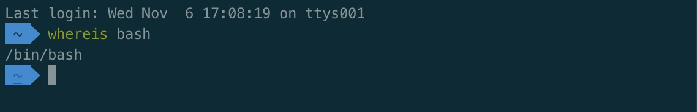

# Bash命令大全

## 前言
&emsp;&emsp;文字配合图片，理论搭配实践，助你轻松记住Bash命令，熟练运用将极大提升工作效率。

## 一.命令行
&emsp;&emsp;本篇**基础+重点**内容。

### 1.基本操作

* **export** ：展示全部的环境变量，如果你想获取某个特殊的变量，用 **echo $变量名**。

* **whatis** ：展示用户命令，系统调用、库函数等。

* **whereis** ：搜索可执行文件、源文件。

* **which** ：在环境变量中搜索可执行文件，并打印完整路径。

* **clear** ：清空屏幕。

### 2.目录操作

* **cd** ：进入指定目录。
e.g.  
cd xxx ：进入个人目录。  
cd - ：返回上次的目录。  
cd / ：进入根目录。

* **pwd** ：打印当前目录的路径。

* **ls** ：列出文件与子目录，**-l** 显示长格式化，**-a** 显示包括隐藏文件。**ls** 除了能默认显示当前目录的文件以及子目录，还可以显示指定目录下的文件以及子目录。
e.g.  
ls ：列出当前目录中的文件以及子目录。  
ls ../ ：列出上级目录下的文件和子目录。  
ls / ：列出根目录下的文件和子目录。  
ls /home ：列出home目录下的文件和子目录。

* **mkdir** ：创建目录。
e.g.  
mkdir xxx ：创建一个目录。  
mkdir xxx1 xxx2 xxx3 ：同时创建多个同级目录。  
mkdir -p a/b/c/d ：如果想创建一个目录树，可以附加一个 -p 参数。

* **rmdir** ：删除空目录。

* **rm -rf** ：强制删除目录（包括非空目录）。
e.g.  
rm -rf xxx ：删除一个非空目录。  
rm -rf xxx1 xxx2 xxx3 ：同时删除多个非空目录。  
rm -rf pattern ：删除按照指定模式匹配到的目录。

* **cp -a** ：复制目录到指定的位置。
e.g.  
cp -a xxx ../xxx ：将当前目录复制一份到上级目录中。  
cp -a xxx xxx1 ：复制目录并重命名。

* **mv** ：移动目录到指定位置。
e.g.  
mv xxx xxx1 ：统计移动，相当于重命名目录xxx为xxx1。  
mv xxx ../xxx1 ：将目录移动到上级目录中并重命名。  
sudo mv /home/user/xxx /home/ ：将指定位置的目录移动到指定位置中。  
mv * ../ ：将所有的目录与文件都复制到上级目录中（ **mv** 可以结合通配符进行使用）。  
补充：利用 **mv** 命令同级移动功能，并结合重命名的特点，就可以做到目录的重命名。  
e.g.  
mv xxx xxx1 ：同级移动，相当于重命名目录xxx为xxx1。

* **tree** ：显示目录的树形图。
e.g.  
tree ：当前目录的树形图。  
tree / ：根目录下的树形图。

&emsp;**常用目录说明：** 
&emsp;&emsp;/ ：根目录。  
&emsp;&emsp;/bin ：命令保存目录。  
&emsp;&emsp;/boot ：启动目录。  
&emsp;&emsp;/dev ：设备文件命令。  
&emsp;&emsp;/etc ：配置文件保存目录。  
&emsp;&emsp;/home ：家目录。  
&emsp;&emsp;/lib ：系统库保存命令。  
&emsp;&emsp;/mnt ：系统挂载目录。

### 3.文件操作

### 4.文本操作

### 5.SSH，系统信息，网络操作

## 二.内建指令

## 三.快捷键
&emsp;&emsp;熟记以下快捷键，将极大的提高你的命令行操作效率。

### 1.编辑命令

### 2.重新执行命令

### 3.控制命令

### 4.Bang（!）命令

### 注意事项

## 参考

[bash 命令和语法--带你升级打 boss | Laravel China 社区 - 高品质的 Laravel 开发者社区](https://learnku.com/articles/5932/bash-command-and-syntax-take-you-to-upgrade-hit-boss)  
[cmd 与 bash 基础命令入门 - 前端 - 掘金](https://juejin.im/entry/5a84461f6fb9a0633f0e20ff)  
[让你提升命令行效率的 Bash 快捷键 [完整版] · LinuxTOY](https://linuxtoy.org/archives/bash-shortcuts.html)
