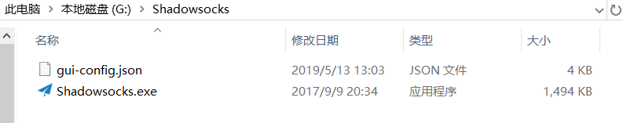

# 科学上网指南

## 前言
&emsp;&emsp;相信不少同学遇到过跟我一样的烦恼，访问一些网站却显示无法访问，使用一些服务却不可用，chrome 浏览器无法更新等等。这些问题是都 **GFW** 的存在而产生的限制，有兴趣的同学可以自行搜索一下，这里就不细说了。总之，一些好用的网站和服务因此在正常情况下无法让我们顺利体验，这的确让人感到比较遗憾，所以接下来就告诉想体验一下的同学如何能够达成目标。

## 1.下载代理工具，并购买服务
&emsp;&emsp;网络上还是有很多代理工具的，也有免费的比如蓝灯。但是为了相对良好的体验，在资金充足的情况下还是建议使用付费产品。  
&emsp;&emsp;这里推荐使用 Shadowsocks ，有必要先介绍一下 Shadowsocks 是什么。

>Shadowsocks（简称SS）是一种基于Socks5代理方式的加密传输协议，也可以指实现这个协议的各种开发包。当前包使用Python、C、C++、C#、Go语言等编程语言开发，大部分主要实现（iOS平台的除外）采用Apache许可证、GPL、MIT许可证等多种自由软件许可协议开放源代码。Shadowsocks分为服务器端和客户端，在使用之前，需要先将服务器端程序部署到服务器上面，然后通过客户端连接并创建本地代理。
&emsp;&emsp;&emsp;&emsp;&emsp;&emsp;&emsp;&emsp;&emsp;&emsp;&emsp;&emsp;&emsp;&emsp;&emsp;&emsp;&emsp;&emsp;&emsp;&emsp;&emsp;&emsp;&emsp;&emsp;&emsp;&emsp;&emsp;&emsp;&emsp;&emsp;&emsp;&emsp;&emsp;&emsp;&emsp;&emsp;&emsp;&emsp;&emsp;&emsp;&emsp;&emsp;&emsp;&emsp;&emsp;&emsp;——维基百科

&emsp;&emsp;简单来说，Shadowsocks 可以为我们提供代理服务，我们通过代理就可以突破限制，实现科学上网。而且 Shadowsocks 操作简单，功能强大。经过一段时间的使用确实感觉很不错，实在是一个不错的选择。 `(不是广告)`  
&emsp;&emsp;话不多说，奉上链接 [Go](https://portal.shadowsocks.nl/aff.php?aff=25277) 。  
&emsp;&emsp;**①.进入后首先看到了如下界面，这里要先注册一个账号。**

&emsp;&emsp;**②.按要求注册成功并登录后，找到产品服务—购买新产品，点击进入。**

&emsp;&emsp;**③.然后你会看到有三种产品，请根据自身实际需要选择合适的产品，一般个人使用的话入门版就够用了。这里我们就选择入门版，点击立即购买后，进入支付环节，请选取适合自己的年限及支付方式完成购买。**

&emsp;&emsp;**④.服务已经买好了，我们还需要下载 Shadowsocks 的客户端。这里可以直接在技术支持—资源下载中找到 Shadowsocks 客户端下载，选择适合自己的版本下载后解压放到一个文件夹中。**

&emsp;&emsp;**⑤.选择产品服务—我的产品与服务，找到刚刚购买的服务点击进入。找到配置文件，点击下载会得到一个 gui-config.json 文件，将这个文件也放入到刚才创建的文件夹中。**

&emsp;&emsp;**⑥.至此，Shadowsocks 就配置成功了，你可以打开它，并在桌面的右下角里找到它。右键点击会出现一个菜单，可以先将开机启动勾选，这样就不用每次都要手动打开了。**  
  

&emsp;&emsp;**菜单里有几个选项，这里需要说明一下：**
* **系统代理模式分为全局模式和PAC模式。**  
全局模式：全局模式是设置你的系统代理的代理服务器，使你的所有 http/socks 数据经过代理服务器的转发送出。而只有支持 socks5 或者使用系统代理的软件才能使用 Shadowsocks（一般的浏览器都是默认使用系统代理）。  
PAC 模式：PAC 模式是会在你连接网站的时候读取 PAC 文件里的规则，来确定你访问的网站有没有被限制，如果符合，那就会使用代理服务器连接网站，而 PAC 列表一般都是从 GFWList 更新的。GFWList 定期会更新被限制的网站（不过一般挺慢的）。

&emsp;&emsp;简单地说，在全局模式下，所有网站默认走代理。而 PAC 模式是只有被限制的才会走代理，推荐 PAC 模式，如果 PAC 模式无法访问一些网站，就换全局模式试试，一般是因为 PAC 更新不及时（也可能是 GFWList 更新不及时）导致的。

* **服务器中可以切换到自己需要的服务器。也可以让服务器自动切换，这里有三种模式：**  
负载均衡：最优化选择服务器。  
高可用：根据延迟和丢包率自动选择服务器。  
根据统计：通过定时 ping 来测速和选择服务器。

>&emsp;&emsp;其实现在打开浏览器就可以访问那些被限制的网站了，可以说已经达成目标了，耐心不足的同学可以先到此为止余下的等以后再浏览。  
&emsp;&emsp;当然，如果有追求更良好的体验的同学，请耐心再往下看。

## 2.安装浏览器插件—Proxy SwitchyOmega

&emsp;&emsp;Proxy SwitchyOmega 是一款 Chrome 和 Firefox 浏览器上的代理扩展程序，可以轻松快捷的管理和切换多个代理设置，情景模式支持多种规则（自定义，PAC，GFWList）自动切换，非常方便。  
&emsp;&emsp;这里以 Chrome 为例，请同学们自行在 Chrome 网上应用商店中找到 Proxy SwitchyOmega 并添加至 Chrome 。  
&emsp;&emsp;下面主要说一下 Proxy SwitchyOmega 的基本配置与使用。  
&emsp;&emsp;安装好后在 chrome 浏览器右上角会出现一个圆环图标就是 Proxy SwitchyOmega 插件了，鼠标左键点击可以看到默认配置。  

* 首先是直接连接和系统代理。  
直接连接：即不使用任何代理，这样即启用了系统代理，chrome 也不使用代理。  
系统代理：即 chrome 跟着系统代理设置走，这跟关闭这个扩展程序是一样的。
* 中间的 proxy 和 auto switch 属于情景模式，不过是 Proxy SwitchyOmega 提供的一个默认的例子，没有什么用可以直接删除，如果需要使用情景模式需要根据条件自己创建。
* 选项则提供了设置 Proxy SwitchyOmega 的功能。

**下面介绍一下 Proxy SwitchyOmega 的几大功能：**

**①.模式切换**  
&emsp;&emsp;点击扩展图标即可快速切换代理模式：  

**②.情景模式（Proxy SwitchyOmega 的主要功能）**  
&emsp;&emsp;在点击选项后会进入一个 Proxy SwitchyOmega 的设置页面，点击新建情景模式会出现4个选项：代理服务器，自动切换模式，PAC 情景模式和虚情景模式，这是情景模式的4大模式。  

* **代理服务器**

&emsp;&emsp;设置代理服务器地址和代理端口，以及填写不代理的地址列表（主要为内网，本机回环和代理服务器等）。  

* **自动切换模式**

&emsp;&emsp;这是 SwitchyOmega 核心功能，用于选择性代理。有默认情景模式和规则列表模式两个，可以将其填写为已有的其他情景模式，依据规则列表实现对两个情景模式的切换。  
&emsp;&emsp;切换规则中可填写多种条件：  

&emsp;&emsp;并支持在线获取规则列表：  

* **PAC 情景模式**

&emsp;&emsp;支持填写 PAC 地址和编写 PAC 脚本，与系统 PAC 的使用一致。  

* **虚情景模式**

&emsp;&emsp;虚情景模式可以作为某个其他情景模式使用，并可以根据需要更改对象。一般用在自动切换中，这样就可以一次性更改多个条件对应的代理。可用于情景模式的快速切换，相比自动切换模式，可以理解为模式的手动切换。  

**③.规则编写**  
&emsp;&emsp;主要是对自动切换模式的规则进行修改，一种是在设置界面进行编写，这个上面提到了就不多写了，还有就是在浏览网页时操作。  
&emsp;&emsp;例如打开网站失败时，会出现资源未加载：  

&emsp;&emsp;点击可以对此网址建立规则：  

**④.规则更新**  
&emsp;&emsp;设置规则更新间隔：  

**⑤.规则备份**  
&emsp;&emsp;备份和恢复，支持 Google 同步，也支持在线恢复。  

&emsp;&emsp;具体使用举例还见 [Proxy SwitchyOmega 最佳实践](https://tmr.js.org/p/975f8776/)。

## 参考资料

[Shadowsocks - 维基百科, 自由的百科全书](https://zh.wikipedia.org/wiki/Shadowsocks)  
[Shadowsocks PAC模式和全局模式的区别 - 作业部落 Cmd Markdown 编辑阅读器](https://www.zybuluo.com/gongzhen/note/472805)  
[Proxy SwitchyOmega 使用指南 | 明天的乌云](https://tmr.js.org/p/73acc153/)
